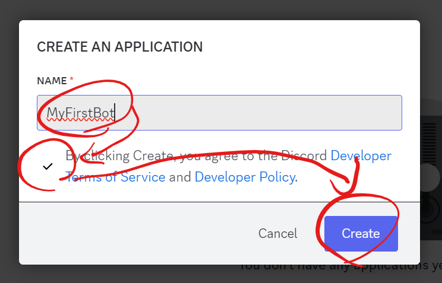

# 디스코드 봇 만들기

---

### 0. 깃클론
```bash
git clone https://github.com/bamjun/first_discord_bot.git && cd first_discord_bot && poetry update && poetry shell
```

### 1. 디스코드 개발자 포털 접속

[디스코드 개발자 포털](https://discord.com/developers/applications)

### 2.우측상단의 `New Application` 클릭


### 3. 어플리케이션 생성




### 4. guild install에 bot 추가하기

  

  

### 5. 메세지 설정 추가  

  


### 6. 토큰 복사

  

### 7. 토큰 config.ini 파일에 넣기

```bash
touch config.ini && echo -e '[discord]\ntoken = SOME_TOKEN' > config.ini
```

### 8. bot_setting.py 실행하기

```bash
python bot_setting.py
```

### 9. 디스코드에서 봇추가하기  


### 10. 복사한 url 실행해서 초대


  


---
# 느낀점
- 파이썬 파일을 계속 실행하고 있어야한다. 내 컴퓨터에서 실행하기 싫으면 서버 비용이 든다..
- 아? 파이썬 애니웨어 쓰면 돼나 ?

